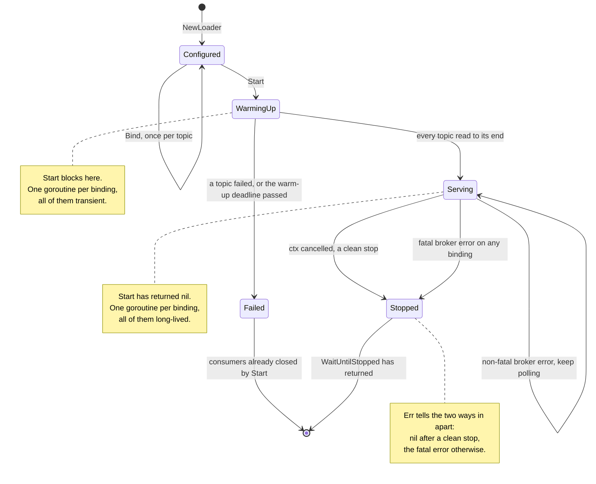
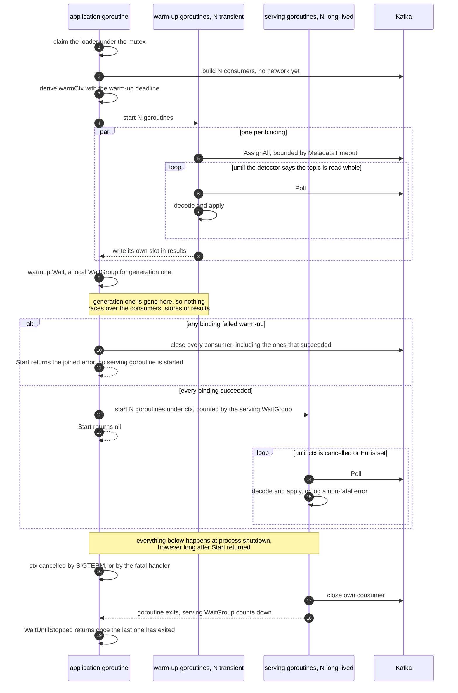

# How easykafka-config-go works

This document is for a developer deciding whether to rely on this library, and it assumes you would
rather understand the machinery than take the README's word for it. It covers what the library
guarantees, what it does not, how it behaves when things go wrong, and why it is built the way it is.

The [README](README.md) is the quick start; the [package
documentation](https://pkg.go.dev/github.com/easykafka/easykafka-config-go) is the reference. This is
the middle: enough to trust it, or to know precisely what you distrust.

---

## 1. The model: a compacted topic is a table

Everything here follows from one idea. On a compacted topic, a record is not an event that happened —
it is the **current value for its key**, replacing whatever came before. An empty record is a delete.
Kafka guarantees the last record for a key survives compaction, so replaying the topic from the
beginning reconstructs the table, whatever was written in between.

That licenses the whole design:

* **Order matters only per key**, and Kafka already provides it per partition, so no coordination is
  needed between partitions.
* **Replaying is idempotent.** Reading the topic twice produces the same table, so there is nothing to
  remember between runs — which is why offsets are never committed.
* **Every replica can hold everything**, because a configuration table is small enough to. That is what
  makes lookups local.

If your data is a log of events rather than a table of current values, this is the wrong library.

---

## 2. Lifecycle

Four states. A loader is configured, warms up, serves, and stops — and the only way to serve is to have
warmed up completely.

Two properties are worth pulling out.

**There is no degraded state.** A binding cannot half-work. Either the loader is serving every topic,
or it is going down. A fatal broker error on one binding stops all of them, because the alternative — a
store frozen at whatever it last held while the process claims to be healthy — is worse than a restart.

**`Failed` owns nothing.** A loader whose `Start` returned an error has no goroutine running and no
consumer open: `Start` closed them before returning. There is nothing to clean up and nothing left for
a second `Start` to trip over.

---

## 3. How it actually runs

Two generations of goroutine, one per binding each, and **they never overlap**. That single property is
what keeps the machinery small.

Because generation one has finished before generation two exists:

* **warm-up results need no channel.** Each goroutine writes its own slot in a pre-sized slice, and the
  `WaitGroup` is the barrier. `errors.Join` then reports every failing topic from one `Start` rather
  than whichever failed first.
* **the phase change needs no signal.** It *is* a `Wait` returning.
* **a consumer passes between goroutines without a lock.** The `WaitGroup` supplies the happens-before,
  and no two goroutines ever hold the same consumer.

Warm-up is concurrent across topics, so startup costs the slowest topic rather than the sum of them.

---

## 4. What it guarantees, and what it does not

### Guaranteed

**Complete configuration, or an error.** `Start` returns `nil` only when every bound topic has been read
to its end. There is no partial success: one topic failing fails the call, so a service that gets past
`Start` is never running on half-loaded configuration.

**Every failure at once.** All bindings are heard out before `Start` decides, so three wrong topic names
are reported in one startup rather than one per restart.

**Per-key ordering**, matching Kafka's per-partition ordering. One goroutine writes each store.

**Reproducibility on restart.** No offset is ever committed, so a new loader over the same topics
rebuilds the same stores. This is a property of the construction, not of anything surviving.

**Reads never block writes, or each other.** Lookups take no lock the caller can see and never observe a
half-applied value: a store holds pointers to fully decoded values, replaced atomically.

**Clean shutdown.** When `WaitUntilStopped` returns, no goroutine is running, every librdkafka handle is
released, and no store is being written.

### Not guaranteed

**No atomicity across topics.** Each binding applies its own records as they arrive. If two topics must
change together, a reader can observe one updated and the other not. There is no transaction, and none
is planned.

**No atomicity across keys**, for the same reason.

**Shutdown is not instant.** A consumer notices cancellation between polls, so stopping takes up to one
steady poll timeout — 100 ms by default.

**A fatal error stops everything.** Not one binding: all of them. This is deliberate ([§2](#2-lifecycle)), but it means
one bad topic can stop a service that could have carried on with the others.

**Memory is the limit.** Each store holds every live key of its topic, decoded, in the memory of every
replica. Sizing is dataset × decoded size × replicas — not the compacted log's byte count.

**At-least-once, not exactly-once.** A record may be applied twice across a restart. That is harmless
here because every apply is an absolute upsert, but it is not a transactional guarantee and must not be
relied on as one.

---

## 5. When things go wrong

| What happens | What the library does |
|---|---|
| A payload will not decode | Skips that record, reports `OnDecodeError`, carries on. Bad data never stops a config topic: there is nothing to retry, since redelivery would fail identically. |
| A key will not decode | The same. The record is dropped before the payload is even looked at. |
| A required topic is empty | `Start` fails with `ErrEmptyTopic`, naming binding and topic. Nearly always a wrong topic name or a topic never populated. Set `AllowEmpty` on bindings where empty is legitimate. |
| A topic does not exist | `Start` fails, and says so rather than treating it as empty. |
| The broker is unreachable at startup | `Start` fails once metadata times out, or on `WithWarmupTimeout`. |
| Warm-up takes too long | With `WithWarmupTimeout` set, `Start` fails with `ErrWarmupTimeout`. Without it, `Start` waits — which is correct for a large topic and dangerous for a leaderless partition. |
| The broker goes away while serving | Nothing breaks. The stores keep answering from what they hold, librdkafka reconnects, `OnKafkaError` fires meanwhile, and consumption resumes on its own. This is exercised against a real broker that is stopped and restarted mid-test. |
| A binding hits a fatal broker error | Records it, fires `WithFatalHandler` once, and every binding stops. `Err` then reports why, and `WaitUntilStopped` returns it. |
| The record key and the payload's key disagree | Only detected if `VerifyKeyAgreement` is set, and then only reported — the entry goes under the payload's key while a tombstone would carry the record's, so it could never be deleted. Worth alerting on. |

The library never calls `log.Fatal` or `os.Exit`. Every failure is an error, a lifecycle state, or an
observer callback, and the service decides what to do about it.

---

## 6. Design decisions, and what they cost

**Partitions are assigned explicitly; no consumer group is ever joined.**
*Buys:* every replica reads every partition, which is what a lookup table needs. No rebalance, no
partition assignment protocol, no group coordinator load, no `POD_NAME`-style identity, and no group
metadata accumulating in the cluster. Adding a replica costs the cluster nothing.
*Costs:* the library owns partition discovery, so a topic whose partition count grows is not picked up
until a restart.

**Offsets are never committed.**
*Buys:* a restart re-reads by construction, so the store is reproducible and there is no checkpoint to
corrupt or lose. It is also what makes a shared, inert `group.id` safe across replicas.
*Costs:* startup always pays for the full topic. For a large topic that is real time, and the reason
warm-up is concurrent across topics.

**One consumer per topic, one goroutine per consumer.**
*Buys:* topics warm up in parallel and apply in parallel, so a burst on one topic does not delay
another's updates. Error attribution is per topic.
*Costs:* N consumers means N sets of librdkafka fetch buffers. A single consumer assigned across all
topics would use less memory, but would serialise decode-and-apply across them.

**Warm-up finishes before serving starts.**
*Buys:* the small machinery described in [§3](#3-how-it-actually-runs) — no channel, no signalling, no lock on the handover.
*Costs:* 2N goroutines over a process lifetime instead of N. Negligible.

**Stopping belongs to the caller.**
*Buys:* no cancellation inside the library, nothing to close, no `sync.Once` — cancel the context you
gave `Start`, then wait. Ten lifecycle fields became five when this was adopted.
*Costs:* a caller who passes a context nothing cancels cannot stop the loader, and `WaitUntilStopped`
would block until the process ends.

**The library never terminates the process.**
*Buys:* a library that cannot surprise you. Every failure is visible and yours to act on.
*Costs:* you must act on it. A service that ignores `WithFatalHandler` and never reads `Err` will run on
frozen configuration until something else notices.

**Values are stored as pointers to decoded structs.**
*Buys:* lookups are a map read with no decode, no copy and no allocation.
*Costs:* readers share the pointer, so a value must be treated as immutable. The library never writes
through a published pointer; callers must not either.

---

## 7. Observability

Two mechanisms, for two different jobs.

**`Observer` is push, per event, and suits counters.** It reports every record applied, deleted,
filtered, or rejected as undecodable, plus key mismatches, Kafka errors, load progress and the warm-up
phase change. `NopObserver` is the default; embed it so your implementation keeps compiling as the
interface grows.

**`Stats()` is pull, a snapshot, and suits gauges.** Per binding: phase, current size, cumulative
upserts, deletes, filtered and decode errors, how many records warm-up applied and how long it took, and
when a record last arrived. Reading it costs nothing but a few atomic loads.

Counting records through `Stats` would miss everything between samples; deriving current size from
`Observer` would mean reconstructing a gauge from deltas. Use each for what it is.

Beyond those, the library logs its own lifecycle — topic read to end, configuration loaded, binding
stopped, broker connection restored — and the driver logs Kafka errors. Decode errors and key mismatches
reach only the `Observer`, so `WithErrorLogging()` exists for services that wire no observer and would
otherwise skip bad records in silence.

---

## 8. What is deliberately not built

**Two more warm-up detectors.** `IdlePolls` (end warm-up after N consecutive empty polls) and
`Watermarks` (read each partition's high watermark up front and wait for the position to reach it) are
fully designed and not implemented.

`IdlePolls` is strictly weaker than the default and cannot be fixed: an idle poll is a property of the
consumer, not of a partition, so nothing in "no record arrived" says *which* partition failed to
deliver. With one partition stalled and the rest drained, it declares success and the service starts on
a partial store — silently. `PartitionEOF` tracks partitions individually and waits, bounded by
`WithWarmupTimeout`, which is a failure you can see.

`Watermarks` is sound, and would additionally give a consumer-lag figure. It is unbuilt because there is
nowhere to publish that figure from — `Observer` has no periodic callback — and warm-up detection alone
does not repay a broker round trip per partition.

**Anything derived from the state.** No joins, aggregations, windows, or output topics. See [§9](#9-compared-with-kafka-streams).

---

## 9. Compared with Kafka Streams

If you know Kafka Streams, the closest thing to this library is a **`GlobalKTable`**: every instance
reads every partition of a topic into a local store, so any instance can answer for any key. The
topologies genuinely agree — Streams' global consumer also assigns partitions manually and joins no
consumer group.

The first thing to say is that **Kafka Streams is a JVM framework and there is no Go implementation**, so
for a Go service this is not a choice between the two.

| | `easykafka-config-go` | Kafka Streams `GlobalKTable` |
|---|---|---|
| Runtime | a Go library: a loader and a map | a stream-processing framework on the JVM |
| Available from Go | yes | no |
| Topology | every replica reads every partition, no consumer group, no rebalance | the same |
| State store | in-memory map of decoded Go values | RocksDB on disk by default, in-memory optional |
| Dataset size | bounded by the replica's memory | bounded by disk; RocksDB spills, so far larger tables are practical |
| Restart | always re-reads; the store is identical by construction | restores from the state directory when it survives, re-reads when it does not |
| Startup | read to end, then serve | restore the global store, then start processing |
| Lookup | typed map read, no serdes, no lock | store read through the framework's serdes |
| Derived state | none | the point of the framework: joins, aggregations, windows, output topics |
| Delivery semantics | at-least-once application of an idempotent upsert | configurable, including exactly-once |
| Cross-instance queries | none | interactive queries |
| To operate | memory | heap, RocksDB tuning, state directories, standby replicas, changelog topics |

**This library does one thing Streams also does, and none of the rest.** If the state you need is a
compacted topic read into a map, the two agree on the architecture and this is the smaller way to get
there. If you need anything derived from that state, this has no answer and Streams is a real framework
for that job.

Two claims not made here: this is not "faster than Kafka Streams" — nothing has been measured against
it, and for the lookup itself both are local reads — and it does not "avoid network IO", since a global
store is local in both and both keep consuming in the background. What it avoids is RocksDB, a serde
layer, and a JVM.
